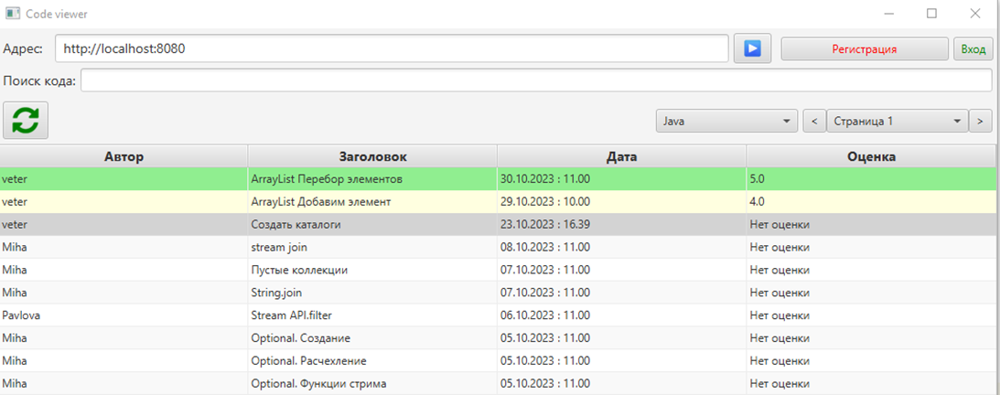

# CodeViewer - просмотрщик постов с кодом

### CodeViewer - Десктопное приложение(JavaFX), представляет из себя фронт для просмотра постов CodeStorage.

### Назначение:

- Добавление постов кода с описанием.
- Просмотр постов
- Комментирование постов
- Оценка постов.

<b>Описание функционала программы</b>

### Форма списка постов

1.	Обновить список постов
2.	Добавить пост
3.	Редактировать пост. Пользователь может редактировать только свой пост, администратор любые посты
4.	Удалить пост. Удалить пост может только администратор
5.	Поле для поиска кода в постах
6.	Адресная строка
7.	Инициализация
8.	Выбор языка постов
9.	Аутентифицированный пользователь или регистрация нового пользователя
10.	Вход/выход пользователя
11.	Навигация по старницам постов(Используя фильтр кода и языка постов)

### Форма аутентификация пользователя

1.	Логин
2.	Пароль
3.	Выполнить аутентификацию

### Форма создания пользователя

1. Логин
2. Пароль
3. ФИО
4. Почта
5. Создать пользователя
      
### Форма Просмотр поста
#### Вкладка Пост

7. Оценка поста
8. Оценить пост

#### Вкладка Комментарии

1. Обновить список комментариев
2. Добавить комментарий. Только для зарегистрированных пользователей
3. Навигация по старницам комментариев

### Форма создания/редактирования поста

5. Заголовок
6. Описание
7. Код
8. Создать пост

#### Стек-технологий, используемый в приложении:
- JavaFX 17
- jackson 2.15
- lombok